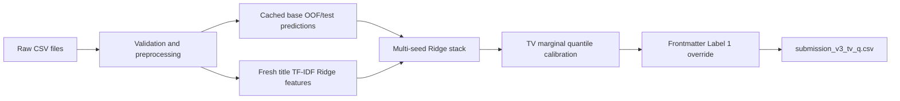

# Tables and Figures

All generated assets are under `final_materials/tables/` and `final_materials/figures/`.

## 1. Dataset Summary Table

Source: `tables/dataset_summary.csv`

| file | rows | columns | label available | label range |
|---|---:|---:|---|---|
| train.csv | 2494 | 7 | yes | 1-5 |
| public_test.csv | 298 | 6 | no | not available |
| private_test.csv | 298 | 6 | no | not available |
| Test_Submission.csv | 596 | 2 | placeholder | 1 placeholder |
| submission_v3_tv_q.csv | 596 | 2 | predicted | 1-5 |

Suggested placement:

- Report: Data Preprocessing section.
- Slides: Slide 3.

## 2. Label Distribution Table and Chart

Source table: `tables/label_distribution_train.csv`

| Label | Train count | Train percent |
|---:|---:|---:|
| 1 | 903 | 36.21 |
| 2 | 514 | 20.61 |
| 3 | 438 | 17.56 |
| 4 | 367 | 14.72 |
| 5 | 272 | 10.91 |

Figure: `figures/label_distribution_train.png`

Suggested placement:

- Report: Data Preprocessing or Evaluation section.
- Slides: Slide 2 or Slide 3.

## 3. Missing Value Summary

Source: `tables/missing_values_summary.csv`

Key findings:

- `authors` missing in 192 train rows.
- `authors` missing in 19 public test rows.
- `authors` missing in 22 private test rows.
- Other raw columns used by the final pipeline have no missing values.

Figure: `figures/missing_values_summary.png`

Suggested placement:

- Report: Data Preprocessing section.
- Slides: Slide 3.

## 4. Pipeline Diagram

Figure: `figures/pipeline_diagram.png`

Editable Mermaid source: `tables/pipeline_diagram.mmd`

Pipeline:

Suggested placement:

- Report: Methodology section.
- Slides: Slide 4 or Slide 5.

## 5. Model and Experiment Comparison Table

Source: `tables/experiment_comparison.csv`

| Experiment | Validation QWK all | Validation QWK test-venue | Public QWK | Private QWK |
|---|---:|---:|---:|---:|
| Title TF-IDF + Logistic/Ridge baseline | 0.565 from project report | not available | not available | not available |
| Venue mean + optimized thresholds | 0.298 from project report | not available | not available | not available |
| S2 META stack | not recomputed here | available in rebuild logs, not saved table | around 0.72 earlier plateau | not available |
| Rebuild v3 Ridge stack, alpha=5.0 | 0.6719 | 0.6708 | not directly submitted | not directly submitted |
| submission_v3_tv_q.csv | v3 ranking + TV quantile calibration | test-venue marginal calibration | 0.75557 | 0.73479 |

Suggested placement:

- Report: Experimental Setup and Evaluation sections.
- Slides: Slide 6 or Slide 7.

## 6. Final Submission Score Table

Source: `tables/final_submission_score.csv`

| submission | public QWK | private QWK | status |
|---|---:|---:|---|
| submission_v3_tv_q.csv | 0.75557 | 0.73479 | final selected |

Suggested placement:

- Report: Introduction and Evaluation sections.
- Slides: Slide 1 and Slide 7.

## 7. Prediction Distribution Table and Chart

Source: `tables/prediction_distribution_submission_v3_tv_q.csv`

| Label | Predicted count | Predicted percent |
|---:|---:|---:|
| 1 | 229 | 38.42 |
| 2 | 128 | 21.48 |
| 3 | 106 | 17.79 |
| 4 | 82 | 13.76 |
| 5 | 51 | 8.56 |

Figures:

- `figures/prediction_distribution_v3_tv_q.png`
- `figures/train_vs_prediction_distribution.png`

Suggested placement:

- Report: Evaluation and Analysis section.
- Slides: Slide 7.

## 8. Consistency Checks

Source: `tables/consistency_checks.csv`

Key checks:

- Duplicate train IDs: 0.
- Duplicate public IDs: 0.
- Duplicate private IDs: 0.
- Shared train-test titles: 0.
- Shared train-test DOI/link strings: 3, inspected and not used as leakage.
- `Test_Submission.csv` ID order matches public + private test order: true.
- Final submission ID order matches `Test_Submission.csv`: true.
- Final labels are in 1..5: true.

Suggested placement:

- Report: Data Preprocessing section.
- Appendix if the main report needs to be shorter.

## 9. Feature List

Source: `tables/v3_feature_list.csv`

Use this table if the report needs an appendix listing the 23 final stack features. In the main report, group the features by model family instead of listing every feature inline.
